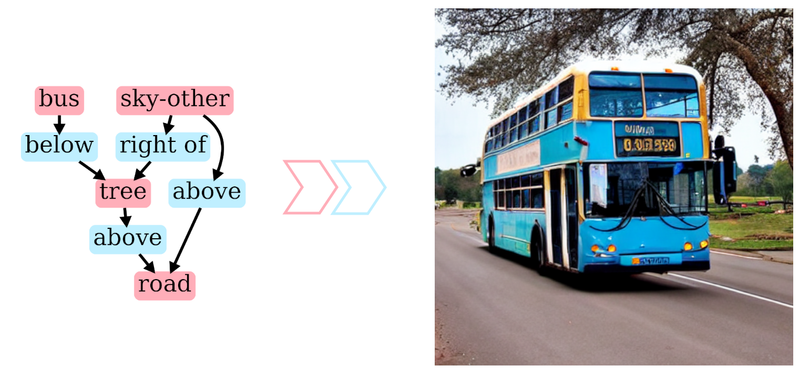

# SGCond

Generating images from scene graphs using conditional control of diffusion models.

# Info

- Right now we use a modified version of [sg2im](https://github.com/google/sg2im) for scene layout generation
- Scene graphs are stored in data.json
- Scene layout generation (bounding boxes and semantic maps) is done in prepare.ipynb
- ControlNet.ipynb creates images from semantic maps
- GLIGEN.ipynb creates images from bounding boxes
- evaluate.ipynb measures insception score and FID score
